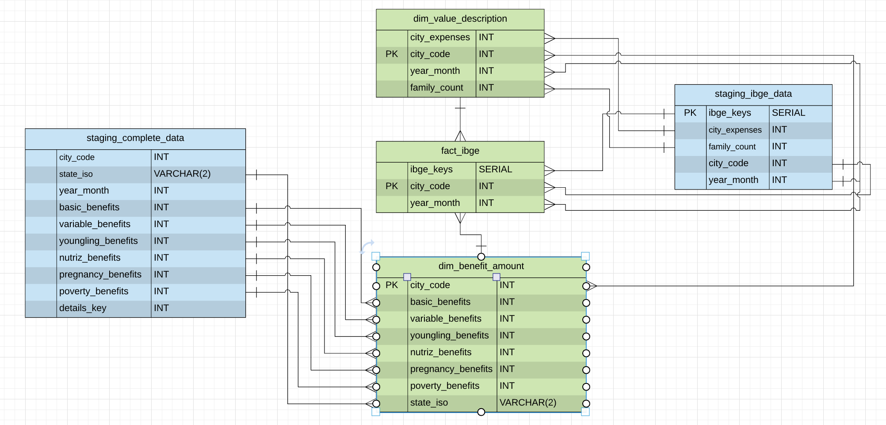
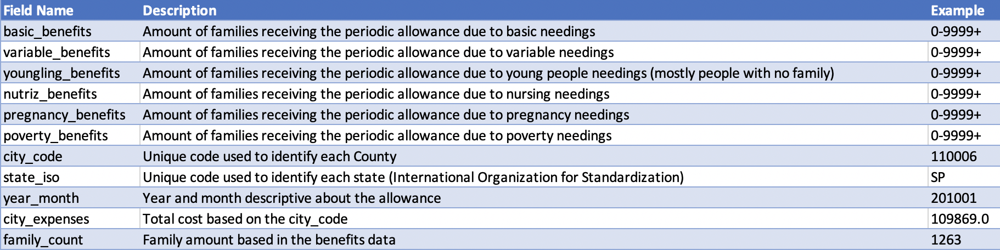

# CAPSTONE(IBGE - DATA ENGINEERING FOR ANALYTICS)

This is an ETL project focused on the IBGE(Brazilian Institute of Geography and Statistics) assistence called 'Bolsa Familia'.

Bolsa Família (or Family Allowance) is a social welfare program provided by the Brazilian government, which provides financial aid to poor Brazilian families and for people with special necessities.

The program attempts to both reduce short-term poverty by direct cash transfers and fight long-term poverty by increasing human capital among the poor through conditional cash transfers. It also works to give free education to children who cannot afford to go to school thus reinforcing the value of education amongst these poorer families.
## Purpose

This project creates a data pipeline that extracts data from multiple json files and then matches, loads and inserts that data into the required database formats.

## Database Schema

The database is a star schema based on the 'fact_ibge_table' table in the middle, and 2 supporting dimension tables (dim_value_description and dim_benefit_amount).

Star schema databases are tradionally found in data warehouses. They are designed to provide easy querying of the containted data. Typically focusing on the Fact Table and doing simple joins to the associated Dimension Tables.

##STAGING
#staging_ibge_data
`city_expenses INT NOT NULL,family_count INT NOT NULL, city_code INT NOT NULL, year_month INT NOT NULL, ibge_keys INT NOT NULL SERIAL PRIMARY KEY`


#staging_complete_data
`city_code INT NOT NULL PRIMARY KEY, state_iso VARCHAR NOT NULL(2), year_month INT NOT NULL, basic_benefits INT NOT NULL, variable_benefits INT NOT NULL, youngling_benefits INT NOT NULL, nutriz_benefits INT NOT NULL, pregnancy_benefits INT NOT NULL, poverty_benefits INT NOT NULL, details_key INT NOT NULL SERIAL PRIMARY KEY`

##FACT
#fact_ibge
`ibge_keys SERIAL NOT NULL, city_code INT NOT NULL PRIMARY KEY,year_month INT NOT NULL`

##DIMMENSION TABLES

#dim_benefit_amount
`city_code INT NOT NULL PRIMARY KEY, basic_benefits INT NOT NULL, variable_benefits INT NOT NULL, youngling_benefits INT NOT NULL, nutriz_benefits INT NOT NULL, pregnancy_benefits INT NOT NULL, poverty_benefits INT NOT NULL, state_iso VARCHAR NOT NULL`

#dim_value_description
`city_code INT NOT NULL PRIMARY KEY,year_month INT NOT NULL, family_count INT NOT NULL, city_expenses INT NOT NULL`


##CONFIG FILE SETUP
To run this project you will need to fill the following information, and save it as `ibge.cfg` in the project root folder.

```
[AWS]
KEY=
SECRET=

[IAM_ROLE]
ARN=

[CLUSTER]
CLUSTER_TYPE=multi-node
CLUSTER_IDENTIFIER=ibge_capstone
NUM_NODES=4
NODE_TYPE=dc2.large

[CONNECTION]
HOST=
DB_NAME=
DB_USER=
DB_PASSWORD=
DB_PORT=

[DATA]
IBGE_DATA='/data/ibge_benefit'
COMPLETE_DATA='/data/ibge_complete'
```

## Executing the project
1. Open project workspace
2. Run terminal
    1. Run 'pip install -r requirements.txt'
    2. Run create_cluster.py
    3. Run create_tables.py
    4. Run etl.py

### Steps followed on this project

1. Create Table Schemas
- Designed a schema for the fact and the dimension tables. Also designed the staging tables.
- Wrote a SQL CREATE statement for each of these tables in sql_queries.py
- Completed the logic to have create_tables.py to connect to the database and create these tables
- Wrote SQL DROP statements to drop tables at the beginning of - create_tables.py if the tables already exist. This way, you can run create_tables.py whenever you want to reset your database and test your ETL pipeline.
- Launches a redshift cluster and create an IAM role that has read access to S3.
- Adds redshift database and IAM role info to ibge.cfg.
- Test by running create_tables.py and checking the table schemas in your redshift database. You can use Query Editor in the AWS Redshift console for this.

2. Build ETL Pipeline
- Implemented the logic in etl.py to load data from S3 to staging tables on Redshift.
- Implemented the logic in etl.py to load data from staging tables to analytics tables on Redshift.
- Tested by running etl.py after running create_tables.py and running the analytic queries on the Redshift database to compare results with the expected results.
- Deletes the redshift cluster when the run is finished.

# Technical Details

## Use Cases
1. Government budget spending audit.
2. It is a common thing when politician gets elected, to promise helping a `x` amount of families and doing this spending a `y` amount of their budget. This project was designed to easily audit the consistency of the public spending.

## Data Source
- http://dados.gov.br/dataset/beneficios-bolsa-familia-mi-social
- http://dados.gov.br/dataset/bolsa-familia-misocial

## Timing
This dataset is completely public and gets commited every month. We already have the raw data from `IBGE` since 2004 and the complete data since 2014. The complete data is being recursively commited and should be paired with the raw data soon.

# Dissertation

How do you make your database could be accessed by 100+ people? Can you come up with a more cost-effective approach? Does your project need to support 100+ connection at the same time?
- AWS Redshift can easily handle these connections with the appropriate hardware. Remembering that the cluster size would need to be increased.
- Turning the database access public for reading is also a good way to increase the connections amount without increasing the infrastructure costs.

When the data was increased by 100x, do you store the data in the same way? If your project is heavy on reading over writing, how do you store the data in a way to meet this requirement? What if the requirement is heavy on writing instead?
- Amazon Redshift is a fully managed, distributed relational database system. It is capable of performing queries efficiently over petabytes of data. High parallel processing, columnar design and data compression encoding schemes help achieve fast query processing. It is important to understand how to optimize tables to leverage the highly parallel nature of Amazon Redshift by defining Redshift Distribution Keys (Even Distribution, Key Distribution, All distribution, ).

- Choosing the right Distribution Styles
The motive in selecting a table distribution style is to minimize the impact of the redistribution by relocating the data where it was prior to the query execution. Choosing the right KEY is not as straightforward as it may seem. In fact, setting wrong DISTKEY can even worsen the query performance.

How do you run this pipeline on a daily basis by 7 am every day. What if the dag fails, how do you update the dashboard? Will the dashboard still work? Or will you populate the dashboard by using last day?
- In this case, the most effitient way is using Airflow. The dags should be configured in this order
- - create_clusters >> drop_table_queries
- - drop_table_queries >> create_table_queries
- - create_table_queries >> copy_table_queries
- - copy_table_queries >> insert_table_queries

- As this dataset is monthly commited, if you choose to run it daily, you should consider keeping the last day to populate the database.

The choice of tools, technologies, and data model are justified well.
In your readme file, please list out the tools, technologies, and data model you used. Also provides justification on why making these choices.

## The choice of tools, technologies, and data model

- AWS(Amazon Web Services)
In this project, AWS was the main technology considered to store our data. Doing this, allows us to have the data available every time and everywhere we need. AWS also haves some really good ways to control our budget, and many free tier technologies.

- Redshift
Redshift is an awesome way to store our data, being able large sets of data and multiple connections.

- Data Model


- Data Dictionary



